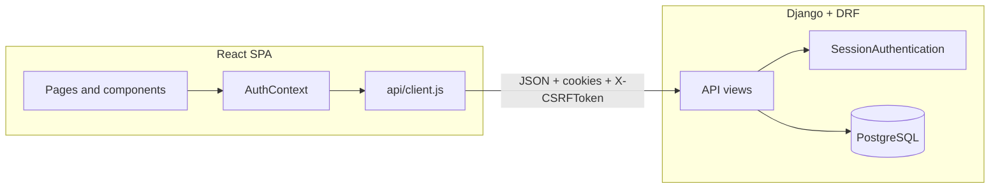
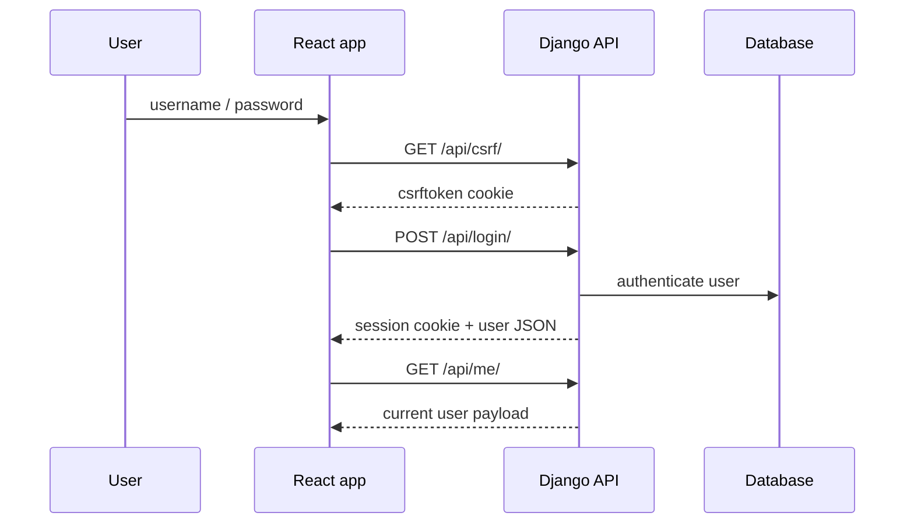
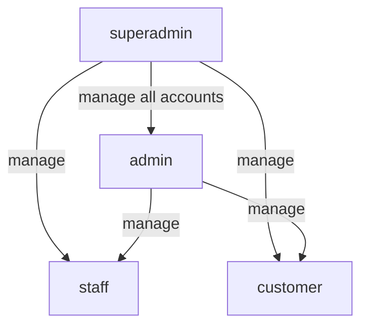
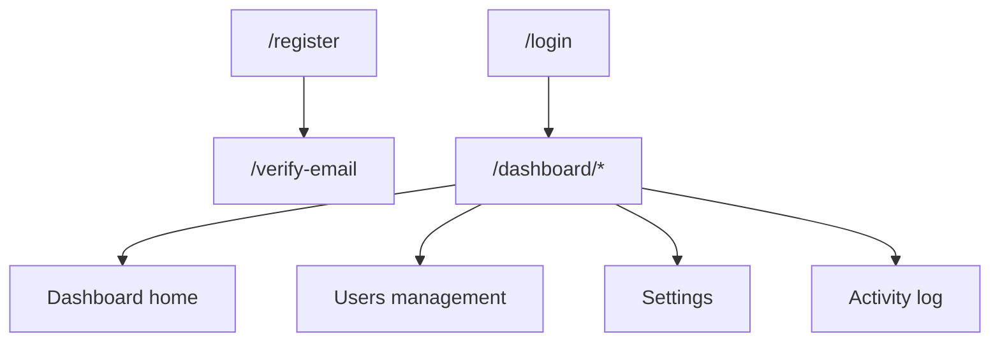

# Boilerplate overview

This document describes the current **portal** boilerplate as it exists in code today: stack, layout, main flows, and the configuration decisions that make it practical to fork into a real product.

## What it is

A **Django REST API** + **React (Vite) SPA** with:

- Session-based authentication using Django cookies and CSRF protection
- Email/password registration, verification, login, logout, and password reset
- Google sign-in with Google Identity Services
- Role-based access control
- User administration, notifications, audit logging, and per-user preferences

## Tech stack

| Layer | Choice |
|--------|--------|
| API | Django 6, Django REST Framework |
| Auth | Django sessions + CSRF |
| DB | PostgreSQL in app runtime, SQLite by default in tests |
| SPA | React 19, React Router 7, Vite |
| Browser auth add-on | `@react-oauth/google` |
| CORS | `django-cors-headers` |

## Repository layout

```text
backend/portal/              # Django project root
  portal/                    # settings, urls, wsgi
  app/                       # models, serializers, views, auth helpers, migrations
frontend/
  src/
    api/client.js            # fetch wrapper, CSRF bootstrap, 401 handling
    context/AuthContext.jsx  # auth bootstrap and session state
    services/                # auth, users, notifications, preferences, audit APIs
    routes/ProtectedRoute.jsx
    pages/                   # login, register, dashboard, settings, activity, etc.
    components/              # layout, notifications, auth UI
docs/
  BOILERPLATE.md             # this document
```

All backend routes are mounted under **`/api/`** in [portal/urls.py](D:/Projects/Basecode%20(Boilerplate)/backend/portal/portal/urls.py).

## Architecture



## Authentication workflow

### Session login

The SPA does not store bearer tokens. Instead, it:

1. Fetches `/api/csrf/` when it needs a CSRF token for a write request
2. Posts credentials to `/api/login/`
3. Receives a user payload while Django sets the authenticated session cookie
4. Calls `/api/me/` on bootstrap to restore the session after refresh



### Registration and verification

1. `POST /api/register/` creates an inactive customer account
2. The backend generates and emails a 6-digit verification code
3. `POST /api/verify-email/` activates the account after code validation
4. `POST /api/resend-verification/` reissues a code if needed

### Password reset

1. `POST /api/password-reset/` emails a reset link
2. `POST /api/password-reset/confirm/` validates `uid` + token and updates the password

### Google sign-in

The frontend obtains a Google ID token and posts it to `/api/auth/google/`. The backend verifies the token against `GOOGLE_CLIENT_ID`, links or creates the local user, and starts a Django session.

Important: runtime only needs the OAuth **client ID** in env. Downloaded Google OAuth client-secret JSON files should stay out of source control.

## Role model

Roles live on `Profile.role`:

- `superadmin`
- `admin`
- `staff`
- `customer`

Manager permissions are enforced in [user_views.py](D:/Projects/Basecode%20(Boilerplate)/backend/portal/app/user_views.py) and serializers, not only through Django’s built-in staff flags.



## Main models

- `Profile`: role, phone, email verification state, Google account link
- `UserPreferences`: theme, timezone, language, email notification preference
- `Notification`: in-app user notifications
- `AuditLog`: actor, action, resource metadata, timestamp

See [models.py](D:/Projects/Basecode%20(Boilerplate)/backend/portal/app/models.py).

## Frontend routing



`ProtectedRoute` blocks unauthenticated access to the dashboard and redirects users to `/login`.

## Main API surface

| Method | Path | Purpose |
|--------|------|---------|
| GET | `/api/csrf/` | Issue CSRF cookie/token |
| POST | `/api/login/` | Start authenticated session |
| POST | `/api/auth/google/` | Sign in with Google ID token |
| POST | `/api/logout/` | End authenticated session |
| POST | `/api/register/` | Create inactive account |
| POST | `/api/verify-email/` | Activate account with verification code |
| POST | `/api/resend-verification/` | Resend verification code |
| POST | `/api/password-reset/` | Request reset email |
| POST | `/api/password-reset/confirm/` | Confirm password reset |
| GET/PATCH | `/api/me/` | Read or update own profile |
| GET/POST | `/api/users/` | List or create users for managers |
| GET/PATCH/DELETE | `/api/users/<id>/` | Manage one user |
| GET | `/api/notifications/` | Current user notifications |
| PATCH | `/api/notifications/<id>/` | Mark one notification read |
| POST | `/api/notifications/mark-all-read/` | Mark all notifications read |
| GET/PATCH | `/api/preferences/me/` | Current user preferences |
| GET | `/api/audit-logs/` | Paginated manager audit trail |

## Configuration

Backend configuration lives in [settings.py](D:/Projects/Basecode%20(Boilerplate)/backend/portal/portal/settings.py) and [backend/portal/.env.example](D:/Projects/Basecode%20(Boilerplate)/backend/portal/.env.example).

Key defaults and expectations:

- `DEBUG` is env-driven and defaults to `true` for local development
- PostgreSQL is required for normal app runtime
- Tests default to SQLite for easier onboarding
- `ALLOWED_HOSTS`, `CORS_ALLOWED_ORIGINS`, and `CSRF_TRUSTED_ORIGINS` are env-driven
- Production should set HTTPS cookie flags and HSTS values appropriately
- `FRONTEND_URL` powers email links
- `GOOGLE_CLIENT_ID` must match the frontend `VITE_GOOGLE_CLIENT_ID`

Frontend configuration lives in [frontend/.env.example](D:/Projects/Basecode%20(Boilerplate)/frontend/.env.example).

## Forking guidance

When turning this into a new product:

1. Rename UI branding and project-specific copy
2. Create a new PostgreSQL database and env file
3. Replace demo email sender values
4. Set a new Google OAuth web client ID if using Google sign-in
5. Review role names and access rules before shipping
6. Add product-specific tests before feature work diverges too far

---

Mermaid diagrams render on GitHub and in editors with Mermaid support.
