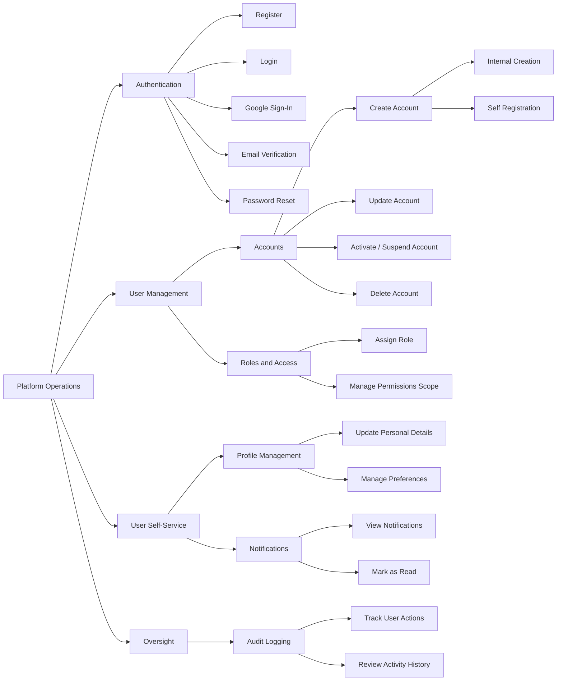

# Conceptual Flow

```mermaid
flowchart LR
  A["Platform Operations"]

  A --> B["Authentication"]
  A --> C["User Management"]
  A --> D["User Self-Service"]
  A --> E["Oversight"]

  B --> B1["Register"]
  B --> B2["Login"]
  B --> B3["Google Sign-In"]
  B --> B4["Email Verification"]
  B --> B5["Password Reset"]

  C --> C1["Accounts"]
  C1 --> C1a["Create Account"]
  C1a --> C1b["Internal Creation"]
  C1a --> C1c["Self Registration"]
  C1 --> C1d["Update Account"]
  C1 --> C1e["Activate / Suspend Account"]
  C1 --> C1f["Delete Account"]

  C --> C2["Roles and Access"]
  C2 --> C2a["Assign Role"]
  C2 --> C2b["Manage Permissions Scope"]

  D --> D1["Profile Management"]
  D1 --> D1a["Update Personal Details"]
  D1 --> D1b["Manage Preferences"]

  D --> D2["Notifications"]
  D2 --> D2a["View Notifications"]
  D2 --> D2b["Mark as Read"]

  E --> E1["Audit Logging"]
  E1 --> E1a["Track User Actions"]
  E1 --> E1b["Review Activity History"]
```
