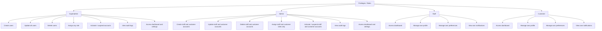

# Privileges Flow

```mermaid
flowchart TD
  A["Privileges / Roles"]

  A --> SA["Superadmin"]
  A --> AD["Admin"]
  A --> ST["Staff"]
  A --> CU["Customer"]

  SA --> SA1["Create users"]
  SA --> SA2["Update all users"]
  SA --> SA3["Delete users"]
  SA --> SA4["Assign any role"]
  SA --> SA5["Activate / suspend accounts"]
  SA --> SA6["View audit logs"]
  SA --> SA7["Access dashboard and settings"]

  AD --> AD1["Create staff and customer accounts"]
  AD --> AD2["Update staff and customer accounts"]
  AD --> AD3["Delete staff and customer accounts"]
  AD --> AD4["Assign staff and customer roles only"]
  AD --> AD5["Activate / suspend staff and customer accounts"]
  AD --> AD6["View audit logs"]
  AD --> AD7["Access dashboard and settings"]

  ST --> ST1["Access dashboard"]
  ST --> ST2["Manage own profile"]
  ST --> ST3["Manage own preferences"]
  ST --> ST4["View own notifications"]

  CU --> CU1["Access dashboard"]
  CU --> CU2["Manage own profile"]
  CU --> CU3["Manage own preferences"]
  CU --> CU4["View own notifications"]
```
